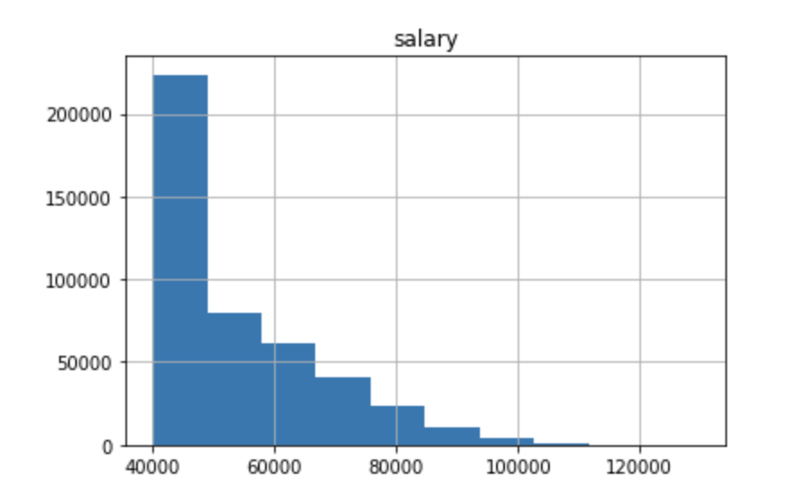
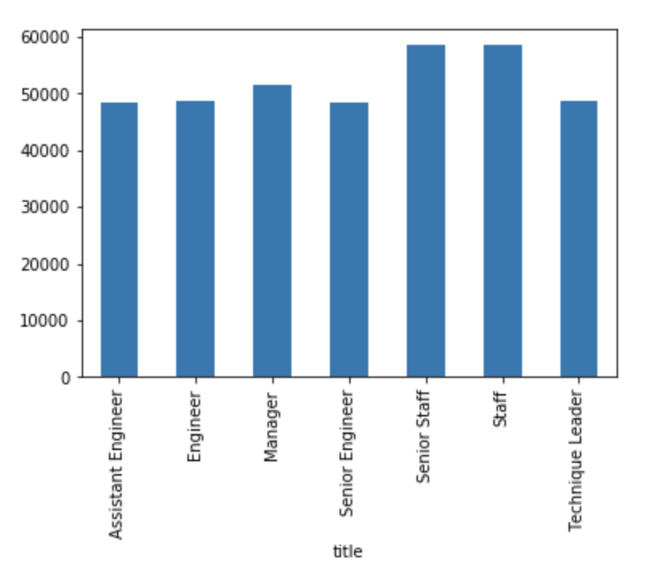

# Employee Database: A Mystery in Two Parts 

I will be conducting a research project on employees of ABC corporation from the 1980s and 1990s. All that remains in the database are six CSV files. 

I will be designing tables to hold data in the CSVs, importing the CSVs into a SQL database, and answering questions about the data. 

## Files
1. Department CSV: department number and department name
2. Department Employee No. CSV: emoloyee number, department number, start and end date
3. Departmnet Manager CSV: department number, employee number, start and end date 
4. Employees CSV: employee number, birth date, first name, last name, gender, hire date
5. Salaries CSV: employee number, salary, start and end date 

## Process 
### Step 1: Data Modeling 
Inspect the CSVs and sketch out an ERD of the tables <br />


### Step 2: Data Engineering
Create a table schema for each of the six CSV files and import each CSV file into the corresponding SQL table
```sql 
CREATE TABLE employees(
	emp_no INT NOT NULL,
	birth_day DATE NOT NULL,
	first_name VARCHAR(14) NOT NULL,
	last_name VARCHAR(16) NOT NULL,
	gender VARCHAR(1) NOT NULL,
	hire_date DATE NOT NULL,
	PRIMARY KEY(emp_no)
);

CREATE TABLE departments (
	dept_no VARCHAR(4) NOT NULL,
	dept_name VARCHAR(40) NOT NULL,
	PRIMARY KEY (dept_no),
	UNIQUE (dept_name)
);

CREATE TABLE dept_manager(
	dept_no VARCHAR(4) NOT NULL,
	emp_no INT NOT NULL, 
	from_date DATE NOT NULL,
	to_date DATE NOT NULL,
	FOREIGN KEY (emp_no) REFERENCES employees(emp_no),
	FOREIGN KEY (dept_no) REFERENCES departments(dept_no),
	PRIMARY KEY (emp_no, dept_no)
); 

CREATE TABLE dept_emp(
	emp_no INT NOT NULL,
	dept_no VARCHAR(4) NOT NULL,
	from_date DATE NOT NULL,
	to_date DATE NOT NULL,
	FOREIGN KEY (emp_no) REFERENCES employees(emp_no),
	FOREIGN KEY (dept_no) REFERENCES departments(dept_no),
	PRIMARY KEY (emp_no, dept_no)
); 

CREATE TABLE titles(
	emp_no INT NOT NULL,
	title VARCHAR(50) NOT NULL,
	from_date DATE NOT NULL,
	to_date DATE,
	FOREIGN KEY (emp_no) REFERENCES employees(emp_no),
	PRIMARY KEY (emp_no, title, from_date)
);

CREATE TABLE salaries (
	emp_no INT NOT NULL, 
	salary INT NOT NULL, 
	from_date DATE NOT NULL,
	to_date DATE NOT NULL,
	FOREIGN KEY(emp_no) REFERENCES employees (emp_no), 
	PRIMARY KEY(emp_no, from_date)
);
```
### Step 3: Data Analysis
1. List the following details of each employee: employee number, last name, first name, gender, and salary
``` sql SELECT emp.emp_no AS "employee number", emp.last_name AS "last name", 
emp.first_name as "first name", emp.gender, sal.salary AS "salary"
FROM employees as emp
JOIN salaries as sal
ON emp.emp_no = sal.emp_no
ORDER BY emp.emp_no;
```
2. List employees who were hired in 1986
```sql SELECT first_name, last_name 
FROM employees
WHERE hire_date BETWEEN '1986-01-01' and '1986-12-31';
```

3. List the manager of each department with the following information: department number, department name, the manager’s employee number, last name, first name, and start and end employment dates
```sql SELECT dm.dept_no, dm.emp_no, d.dept_name
FROM dept_manager AS dm
INNER JOIN departments AS d
ON (dm.dept_no = d.dept_no)
INNER JOIN employees AS e
ON (dm.emp_no = e.emp_no);
```

4. List the department of each employee with the following information: employee number, last name, first name, and department name
```sql SELECT e.emp_no, e.last_name, e.first_name, d.dept_name
FROM employees as e
INNER JOIN dept_emp as de
ON (e.emp_no = de.emp_no)
INNER JOIN departments as d
ON (de.dept_no = d.dept_no)
ORDER BY e.emp_no;
```

5. List all employees whose first name is “Hercules” and last names begin with “B”
```sql SELECT * 
FROM employees 
WHERE first_name = 'Hercules' 
AND last_name LIKE 'B%';
```

6. List all employees in the Sales department, including their employee number, last name, first name, and department name
```sql SELECT e.emp_no, e.last_name, e.first_name, d.dept_name
FROM employees AS e
INNER JOIN dept_emp as de
ON (e.emp_no = de.emp_no)
INNER JOIN departments as d
ON (de.dept_no = d.dept_no)
WHERE d.dept_name = 'Sales'
ORDER BY e.emp_no;
```

7. List all employees in the Sales and Development departments, including their employee number, last name, first name, and department name
```sql 
SELECT e.emp_no, e.last_name, e.first_name, d.dept_name
FROM employees AS e
INNER JOIN dept_emp AS de 
ON (e.emp_no = de.emp_no)
INNER JOIN departments AS d
ON (de.dept_no = d.dept_no)
WHERE d.dept_name IN ('Sales', 'Development')
ORDER BY e.emp_no;
```

8. In descending order, list the frequency count of employee last names, i.e., how many employees share each last name.
```sql
SELECT last_name, COUNT(last_name)
FROM employees
GROUP BY last_name
ORDER BY COUNT(last_name) DESC;
```

### Step 4: Visualize
1. Import SQL database into Pandas
2. Create a histogram to visualize the most common salary ranges for employees

3. Create a bar chart of average salary by title


