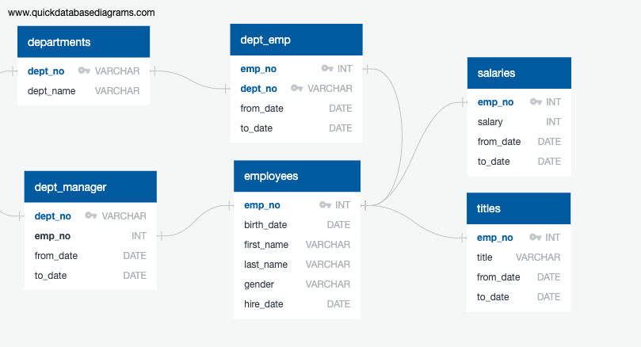

# Employee Database: A Mystery in Two Parts 

I will be conducting a research project on employees of ABC corporation from the 1980s and 1990s. All that remains in the database are six CSV files. 

I will be designing tables to hold data in the CSVs, importing the CSVs into a SQL database, and answering questions about the data. 

## Files
1. Department CSV: department number and department name
2. Department Employee No. CSV: emoloyee number, department number, start and end date
3. Departmnet Manager CSV: department number, employee number, start and end date 
4. Employees CSV: employee number, birth date, first name, last name, gender, hire date
5. Salaries CSV: employee number, salary, start and end date 

## Process 
# Step 1: Data Modeling 
Inspect the CSVs and sketch out an ERD of the tables  

